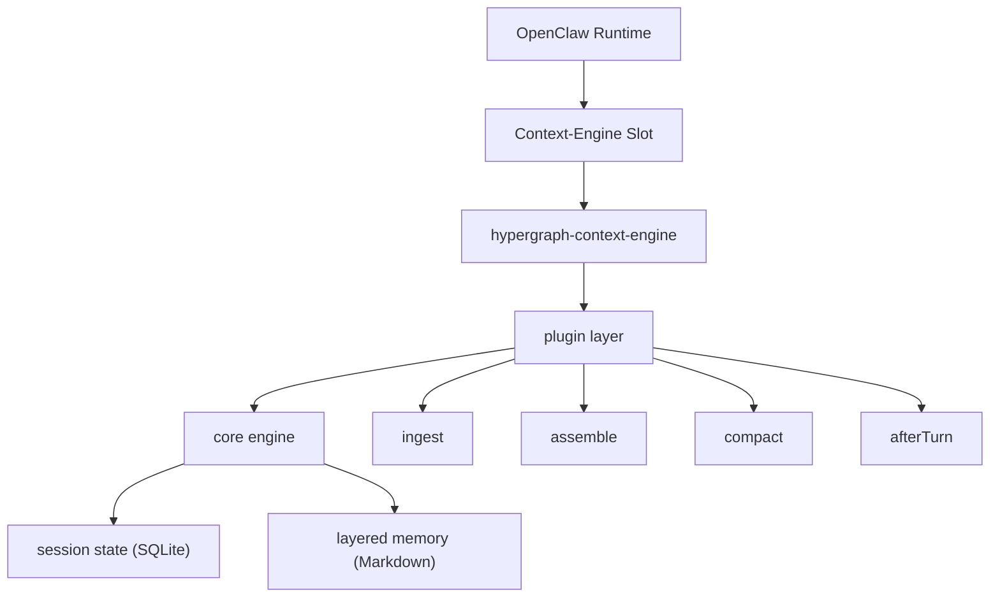
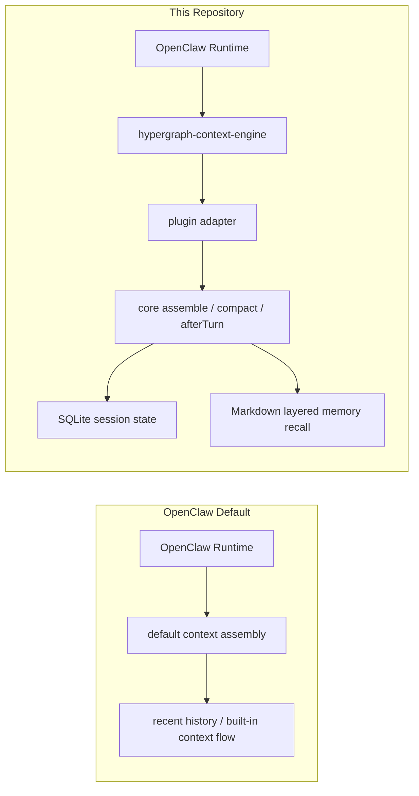

# OpenClaw Context Engine

Hypergraph Context Engine prototype for OpenClaw, with namespace-first Markdown memory routed through a separate repository boundary.

## 需求

OpenClaw 默认能把很多内容塞进一轮 prompt，但有几个问题一直很真实：

- 聊久了，容易忘记现在在做什么
- `current task / next step / previous message` 这类信息容易丢
- 不同 `session / agent / workspace` 的记忆会串
- 压缩上下文以后，有些该留的没留，不该留的却进了长期 memory
- 默认 `MEMORY.md` 太强时，会反过来干扰当前会话

这个插件就是专门解决这些“上下文不稳”问题的。

## 解决方案

这个项目不是重写 OpenClaw，也不是替换 transcript。

它做的事情很简单：

**接管“上下文怎么恢复、怎么组织”这一层。**

- `transcript` 还是 session 事实源
- `SQLite session state` 保存会话里的语义状态
- `.hypergraph-memory/*` 保存分 scope 的 Markdown memory
- `assemble` 时，先保留安全的原始消息，再按规则召回 memory
- `afterTurn / compact` 时，做 flush、maintenance、promotion

它的核心做法就是三件事：

- 用 `session > agent > workspace > global` 做隔离
- 用 `query gate` 控制什么时候该查长期 memory
- 用 `.hypergraph-memory/*` 把插件自己的记忆和 OpenClaw 默认 memory 分开

## 商业模式

这里说的“商业模式”，不是收费，而是这个东西怎么持续产生价值。

它的价值积累方式很直接：

- 每轮对话，把零散信息变成更稳定的 task-state
- 把有用的信息写进 `session / agent / workspace / global`
- 下一轮再把这些 memory 取回来用
- 用得越久，记忆越完整，越不容易乱

所以它不是一次性工具，而是一个会越用越有价值的上下文基础设施。

## 增长

这个插件现在还是 prototype，但往后怎么长已经很清楚。

短期增长：

- 把 `current task / next step / previous message` 做得更稳
- 继续压 prompt token
- 继续清理 runtime 兼容噪音

中期增长：

- 把 retrieval 做得更像 context database adapter
- 引入更清楚的 L0 / L1 / L2 分层加载
- 把 session-driven self-iteration 做稳

长期增长：

- 从 OpenClaw 的 context-engine prototype，长成一套可迁移的 memory / context 基础层
- 以后可以接更强的 index backend，但 Markdown 继续做事实源

## 壁垒

这个项目的壁垒，不是“也能写一个 memory 插件”，而是下面这些东西要一起成立，才有用：

- 深入接 OpenClaw 生命周期：`ingest / assemble / compact / afterTurn`
- session state、runtime identity、Markdown memory 三层边界一起工作
- `session > agent > workspace > global` 已经落到真实代码和真机验证里
- slot-safe message selection、query gate、namespace-first memory layout 是成套配合的
- 它做的不是“存点记忆”，而是“控制上下文怎么恢复”

所以它真正的壁垒是：

**对真实 agent runtime 里“上下文怎么稳定工作”的系统级理解和实现。**

## 现在长什么样

这个仓库现在故意拆成三层：

- `src/core/`
  会话核心引擎。负责 ingest、task-state 恢复、retrieval、assemble、compact，还有 SQLite 持久化。
- `src/memory/`
  Memory 层。负责 Markdown memory 的读写、路由、生命周期规则和临时索引。
- `src/plugin/`
  插件接线层。负责和 OpenClaw 对接、整理配置、解析 runtime identity、缓存 adapter。

测试目录也按这个方式拆开：

- `tests/core/`
- `tests/memory/`
- `tests/plugin/`

## 它怎么接到 OpenClaw 里



直接说人话就是：

- OpenClaw 还是管 runtime 和 transcript 生命周期。
- 这个插件接管的是“上下文怎么恢复、怎么组织”。
- `plugin` 层把 OpenClaw 的生命周期调用翻译成这个仓库里的方法。
- `core` 层负责 session 语义状态。
- `memory` 层负责 scoped Markdown memory 的召回，但它不是 session 事实源。

## 它和 OpenClaw 默认方式有什么不同



还留给 OpenClaw 自己管的：

- runtime lifecycle
- transcript tree
- plugin loading and slot selection

这个插件真正改掉的：

- 上下文怎么组装
- compaction 怎么做
- after-turn maintenance 怎么写入和召回 scoped memory

## 现在它怎么工作

- transcript 还是 session 的主事实源。
- SQLite 只存 session 派生出来的语义状态。
- Markdown workspace 把 scoped memory 写到 `.hypergraph-memory/` 下；旧的 `NOW.md`、`MEMORY.md`、`memory/*` 还能继续读，方便兼容迁移。
- assemble 时，会把 session state 和召回到的 layered memory 合在一起用。
- `memory_chunk` 不再回写进 SQLite session snapshot。
- runtime identity 会先标准化，所以显式 `sessionId` 会优先于 generic runtime key。
- layered memory 是 namespace-aware 的：
  - 写入会带 `sessionId`、`agentId`、`workspaceId`
  - 检索优先级是 `session > agent > workspace > global`
- query gate 默认开启：
  - 会话型 recall 主要用 transcript + task state + session-hot memory
  - greeting / heartbeat / simple ack 这类 turn 默认不查长期 memory

## 快速开始

```bash
npm install
npm run check
npm run demo
npm run memory:demo
npm run demo:snapshots
npm run plugin:check
```

仓库里也有 `npm test`，但在当前这个 Windows sandbox 里，可能会先被 `spawn EPERM` 卡住，还没跑到测试代码。

## 代码里怎么用

```ts
import { HypergraphContextEngine } from './src/core/engine.js';

const engine = new HypergraphContextEngine({
  memoryWorkspaceRoot: 'C:/tmp/openclaw-memory',
  enableLayeredRead: true,
  enableLayeredWrite: true,
  flushOnAfterTurn: true,
  flushOnCompact: true,
});

await engine.ingestMany(sessionId, transcriptEntries);
await engine.flushMemory(sessionId, 'manual_save');

const assembled = await engine.assemble({
  sessionId,
  currentTurnText: 'recover layered memory',
  tokenBudget: 400,
});
```

## Memory 布局

这个仓库现在通过 `src/memory/repository.ts` 管理 layered Markdown memory。

当前写入布局：

- `.hypergraph-memory/session/<session-id>/SESSION_NOW.md`
- `.hypergraph-memory/session/*.md`
- `.hypergraph-memory/agent/*.md`
- `.hypergraph-memory/workspace/*.md`
- `.hypergraph-memory/global/GLOBAL_MEMORY.md`
- `.hypergraph-memory/archive/daily/YYYY-MM-DD.md`

默认行为：

- namespace 目录表达的是 ownership：
  - `session`
  - `agent`
  - `workspace`
  - `global`
- `hot / warm / cold` 不再主导目录结构，而是放在 metadata 和 retrieval policy 里。
- `SESSION_NOW.md` 负责记录当前 session 的 task state，写法偏覆盖更新。
- global memory 保持精简。
- daily log 主要做审计，不是主要检索面。
- 迁移期间，旧的 `NOW.md`、`MEMORY.md`、`memory/*` 还能读，但新的写入都落到 `.hypergraph-memory/*`。

`npm run memory:demo` creates a temporary workspace, writes scoped memory, and prints a `SESSION_NOW.md` preview.

## 作为 OpenClaw 插件怎么用

这个仓库通过 `openclaw.plugin.json` 暴露一个偏 context-engine 的插件。

- Plugin id: `hypergraph-context-engine`
- Runtime entry: `index.ts`
- Shared plugin config: `src/plugin/config.ts`

要注意：

- 这不是一个独立的 `memory` slot 插件
- 它接管的是 context 行为，不是 OpenClaw 默认 memory slot
- 它同时支持 legacy context-engine registration 和 hook-bridge fallback，具体走哪条路取决于宿主 runtime 暴露什么能力

推荐接入方式：

- 如果你的 OpenClaw 暴露了 `plugins.slots.contextEngine`，就把 slot 指到 `hypergraph-context-engine`
- 如果你的 OpenClaw 只暴露 hooks，就让它走 hook-bridge 模式
- 不管哪种情况，最好都显式配置 `memoryWorkspaceRoot`，确保 `.hypergraph-memory/*` 写到你想要的 workspace 里

### 安装到 OpenClaw

把这个仓库作为本地插件安装进去：

```powershell
openclaw plugins install -l "<path-to-your-plugin-repo>"
```

Then enable it. If your OpenClaw runtime supports the `contextEngine` slot, switch that slot to this plugin:

```ts
{
  plugins: {
    enabled: true,
    slots: {
      contextEngine: "hypergraph-context-engine",
    },
    entries: {
      "hypergraph-context-engine": {
        enabled: true,
        config: {
          memoryWorkspaceRoot: "C:/tmp/openclaw-memory",
          enableLayeredRead: true,
          enableLayeredWrite: true,
          enableQueryGate: true,
          disableLongTermMemoryForConversationQueries: true,
          flushOnAfterTurn: true,
          flushOnCompact: true,
          runtimeIdentityDebug: false,
        },
      },
    },
  },
}
```

After updating config, restart OpenClaw Gateway:

```powershell
openclaw gateway restart
```

Useful checks:

```powershell
openclaw plugins list
openclaw plugins inspect hypergraph-context-engine
```

### 卸载和回退

To uninstall the plugin:

```powershell
openclaw plugins uninstall hypergraph-context-engine
```

If you want to switch OpenClaw back to the default context engine, update config like this:

```ts
{
  plugins: {
    slots: {
      contextEngine: "legacy",
    },
    entries: {
      "hypergraph-context-engine": {
        enabled: false,
      },
    },
  },
}
```

Then restart OpenClaw Gateway:

```powershell
openclaw gateway restart
```

Important notes:

- This plugin belongs in `plugins.slots.contextEngine`, not `plugins.slots.memory`, when slot mode is available.
- Installing the plugin is not enough by itself; the plugin entry must be enabled, and slot mode also needs the slot mapping.
- For first-time validation, set an explicit `memoryWorkspaceRoot` and confirm that `.hypergraph-memory/*` is created during a real session.

Config fields:

- `dbPath`
- `disablePersistence`
- `memoryWorkspaceRoot`
- `enableLayeredRead`
- `enableLayeredWrite`
- `enableQueryGate`
- `disableLongTermMemoryForConversationQueries`
- `flushOnAfterTurn`
- `flushOnCompact`
- `promoteOnMaintenance`
- `maintenanceMinIntervalMs`
- `runtimeIdentityDebug`

Retrieval defaults:

- write namespace: `sessionId`, `agentId`, `workspaceId`
- retrieval priority: `session > agent > workspace > global`
- conversation queries such as `previous message`, `first message`, `current task`, `next step`, `continue` stay session-first
- long-term warm/cold memory still participates for project or knowledge queries

Environment fallbacks:

- `OPENCLAW_CONTEXT_ENGINE_DB_PATH`
- `OPENCLAW_CONTEXT_ENGINE_MEMORY_ROOT`
- `OPENCLAW_CONTEXT_ENGINE_DISABLE_PERSISTENCE`
- `OPENCLAW_CONTEXT_ENGINE_DATA_DIR`
- `OPENCLAW_PLUGIN_DATA_DIR`
- `OPENCLAW_DATA_DIR`

## 当前验证情况

The following checks are currently passing:

- `npm run check`
- `npm run plugin:check`
- `npm run memory:demo`
- `npm run runtime:validate`

There is also an additional smoke validation path confirming:

- layered memory is recalled during assemble
- `memory_chunk` nodes are not persisted into SQLite session snapshots
- explicit session ids survive real OpenClaw runs on the Ubuntu test machine
- cross-session `current task / next step` recall stays isolated between explicit sessions
- `SESSION_NOW.md` stays clean and no longer carries completion echo noise into `Current Plan` or `Blockers`

## 下一步最可能做什么

The next engineering step is to put a richer retrieval/index layer behind `src/memory/repository.ts` while keeping Markdown as the source of truth. That can be local BM25, vector recall, or a hybrid index, but the repository boundary should stay the same.
