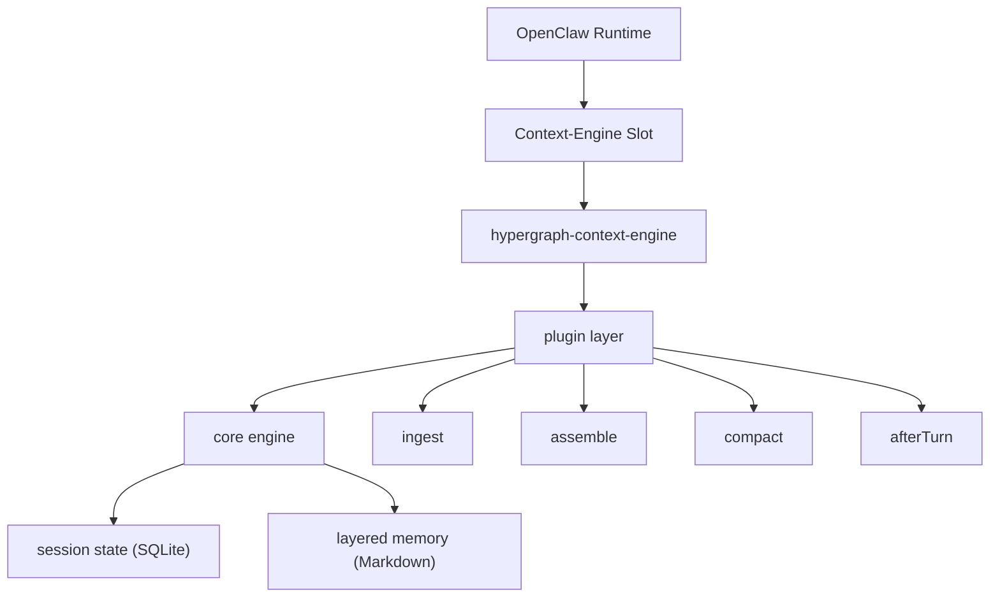
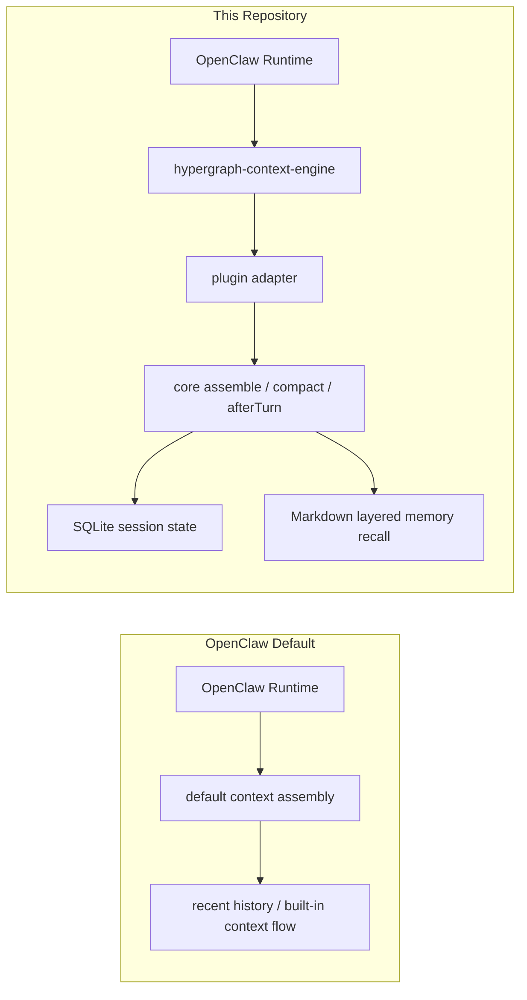

# OpenClaw Context Engine

Hypergraph Context Engine prototype for OpenClaw, with layered Markdown memory routed through a separate repository boundary.

## Current shape

The repository is now intentionally split into three layers:

- `src/core/`
  Core session engine: ingest, task-state recovery, retrieval, assemble, compact, and SQLite persistence.
- `src/memory/`
  Layered Markdown memory: hot/warm/cold routing, workspace reads/writes, lifecycle policy, and transient memory indexing.
- `src/plugin/`
  OpenClaw-facing glue: shared config normalization, runtime adapter caching, and plugin registration boundaries.

Tests follow the same split:

- `tests/core/`
- `tests/memory/`
- `tests/plugin/`

## How It Connects To OpenClaw



In plain terms:

- OpenClaw still owns the runtime and transcript lifecycle.
- This plugin replaces the default context-engine behavior through the `context-engine` slot.
- The plugin layer translates OpenClaw lifecycle calls into this repository's engine methods.
- The core engine manages session semantics.
- The memory layer provides hot/warm/cold Markdown memory recall without becoming the session fact source.

## Default vs This Plugin



What stays with OpenClaw:

- runtime lifecycle
- transcript tree
- plugin loading and slot selection

What this plugin changes:

- how context is assembled
- how compaction is structured
- how after-turn maintenance writes and recalls layered memory

## Current behavior

- Transcript remains the primary session fact source.
- SQLite stores only session-derived semantic state.
- Markdown workspace stores layered memory facts such as `NOW.md`, `MEMORY.md`, and `memory/hot|warm|cold|archive|YYYY-MM-DD.md`.
- Assemble fuses session state with recalled layered memory at read time.
- Layered `memory_chunk` nodes are no longer persisted back into SQLite session snapshots.

## Quick start

```bash
npm install
npm run check
npm run demo
npm run memory:demo
npm run demo:snapshots
npm run plugin:check
```

`npm test` is included, but in this Windows sandbox it may still fail with `spawn EPERM` before test code runs.

## Use from code

```ts
import { HypergraphContextEngine } from './src/core/engine.js';

const engine = new HypergraphContextEngine({
  memoryWorkspaceRoot: 'C:/tmp/openclaw-memory',
  enableLayeredRead: true,
  enableLayeredWrite: true,
  flushOnAfterTurn: true,
  flushOnCompact: true,
});

await engine.ingestMany(sessionId, transcriptEntries);
await engine.flushMemory(sessionId, 'manual_save');

const assembled = await engine.assemble({
  sessionId,
  currentTurnText: 'recover layered memory',
  tokenBudget: 400,
});
```

## Layered memory

This repository now supports layered Markdown memory through `src/memory/repository.ts`.

Workspace layout:

- `NOW.md`
- `MEMORY.md`
- `memory/hot/*.md`
- `memory/warm/*.md`
- `memory/cold/*.md`
- `memory/archive/*.md`
- `memory/YYYY-MM-DD.md`

Behavior defaults:

- `NOW.md` tracks current task state and is overwrite-oriented.
- `memory/hot/*.md` tracks active task/project state.
- `memory/warm/*.md` stores reusable patterns and workflows.
- `memory/cold/*.md` stores long-lived background facts and preferences.
- `MEMORY.md` stays thin and curated.
- Daily logs are audit-oriented, not the primary retrieval surface.

`npm run memory:demo` creates a temporary workspace, writes layered memory, and prints a `NOW.md` preview.

## OpenClaw plugin use

This repository exposes a `context-engine` plugin via `openclaw.plugin.json`.

- Plugin id: `hypergraph-context-engine`
- Kind: `context-engine`
- Runtime entry: `index.ts`
- Shared plugin config: `src/plugin/config.ts`

Important: this is currently a context-engine plugin with layered memory support, not a standalone `memory` slot plugin.

### Install into OpenClaw

Install this repository as a local plugin:

```powershell
openclaw plugins install -l "<path-to-your-plugin-repo>"
```

Then enable it and switch the `contextEngine` slot to this plugin:

```ts
{
  plugins: {
    enabled: true,
    slots: {
      contextEngine: "hypergraph-context-engine",
    },
    entries: {
      "hypergraph-context-engine": {
        enabled: true,
        config: {
          memoryWorkspaceRoot: "C:/tmp/openclaw-memory",
          enableLayeredRead: true,
          enableLayeredWrite: true,
          flushOnAfterTurn: true,
          flushOnCompact: true,
        },
      },
    },
  },
}
```

After updating config, restart OpenClaw Gateway:

```powershell
openclaw gateway restart
```

Useful checks:

```powershell
openclaw plugins list
openclaw plugins inspect hypergraph-context-engine
```

Important notes:

- This plugin belongs in `plugins.slots.contextEngine`, not `plugins.slots.memory`.
- Installing the plugin is not enough by itself; the slot and entry both need to be enabled.
- For first-time validation, set an explicit `memoryWorkspaceRoot` and confirm that `NOW.md` and `memory/*` are created during a real session.

Config fields:

- `dbPath`
- `disablePersistence`
- `memoryWorkspaceRoot`
- `enableLayeredRead`
- `enableLayeredWrite`
- `flushOnAfterTurn`
- `flushOnCompact`
- `promoteOnMaintenance`

Environment fallbacks:

- `OPENCLAW_CONTEXT_ENGINE_DB_PATH`
- `OPENCLAW_CONTEXT_ENGINE_MEMORY_ROOT`
- `OPENCLAW_CONTEXT_ENGINE_DISABLE_PERSISTENCE`
- `OPENCLAW_CONTEXT_ENGINE_DATA_DIR`
- `OPENCLAW_PLUGIN_DATA_DIR`
- `OPENCLAW_DATA_DIR`

## Verification status

The following checks are currently passing:

- `npm run check`
- `npm run plugin:check`
- `npm run memory:demo`

There is also an additional smoke validation path confirming:

- layered memory is recalled during assemble
- `memory_chunk` nodes are not persisted into SQLite session snapshots

## Next likely step

The next engineering step is to put a richer retrieval/index layer behind `src/memory/repository.ts` while keeping Markdown as the source of truth. That can be local BM25, vector recall, or a hybrid index, but the repository boundary should stay the same.
